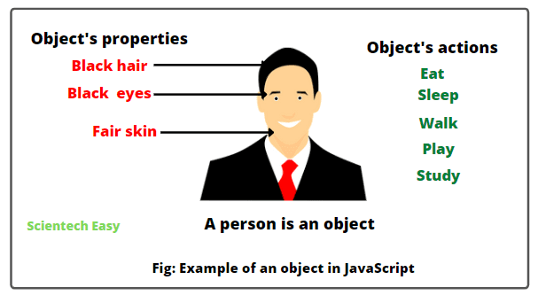
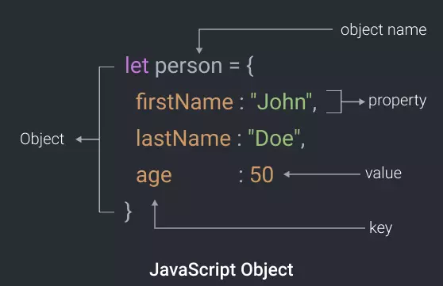

# JS_Presentation5

## What is Object in JavaScript
> В JavaScript объект является автономным
объект со свойствами и типом.
Сравните это, например, с чашкой. А
чашка - это объект со свойствами. Чашка
имеет цвет, дизайн, вес, материал
из чего он сделан и т. д. Таким же образом,
Объекты JavaScript могут иметь свойства,
которые определяют их характеристики.
Все является объектом в JavaScript.
> 

## Создать объект
> 

## Methods object
> - 1) Object.entries()
> 
> - 1) Object. keys()
> 
> - 1) Object. values()
> 

## What is Destructuring and Spread in JavaScript
### Destructuring AND spread in object
> Синтаксис деструктурирующего присваивания представляет собой выражение JavaScript, которое делает его
можно распаковать свойства объекта в отдельные переменные
> 

## What is keyword "this" in JavaScript?
> ##### The this keyvord refers to different objects depending on how   it is used
> - In an object mathod, this refers to the object
> - Alone, this refers to the global object
> - In a function, this refers to the global object
> - In a function, in strict made, this is undefined
>
> ##### this is NOT a variable. It is a keyword. You cannot change the value of this

## What is new Date() in JavaScript?
> In JavaScript, date and time are represented by  the Date object. The Date object provides the date and time information and also provides various methods. A JavaScript date defines the EcmaScript epoch that represents milliseconds since 1 January 1970 UTF. This date and time is the same as the UNIX epoch (predominant base value for computer-recorded date and time values)
> Объекты Date создаются с помощью нового конструктора Date () .
> Существует 4 способа создания нового объекта Date:
> 1) new Date()
> 2) new Date(year, month, day, hours, minutes, seconds, milliseconds)
> 3) new Date(milliseconds)
> 4) new Date(date string)

## Date and time
> 

## new Date(date string)
>

## Date and time
> ##### new Date(year, month, day, hours, minutes, second, milliseconds)
> 

## Methods
> - now()
> - getFullYear()
> - getMounth()
> - getDate()
> - getDay()
> - getHours()
> - getMinute
> - getUTCDate()
> - setFullYear()
> - setMonth()
> - setDate()
> - setUTCDate()

## METHOD now()
> 

## METHOD getFullYear()
> 

## METHOD getMonth9()
> 

## METHOD getDate()
> 

## METHOD getDay()
> 

## METHOD getHours()
> 

## METHOD getMinutes()
> 

## METHOD setDate()
> 

## METHOD setMonth()
> 